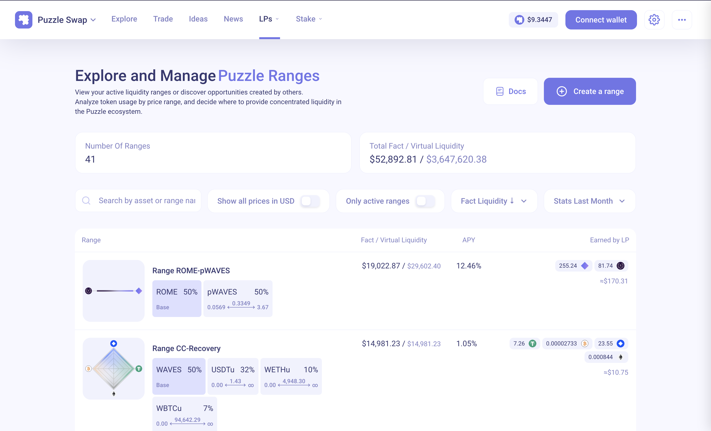
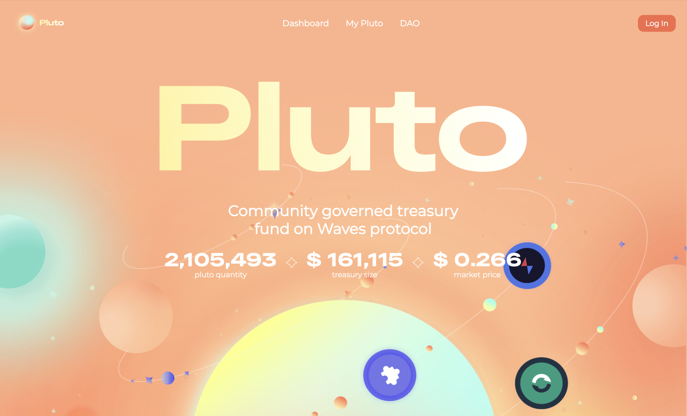

# Alexander Zhuravlev

**Frontend developer — Angular · TypeScript · RxJS.**

Three years shipping production interfaces: LMS already acquired by Budapest University (BME) and high-volume DeFi apps on various blockchains.

Deepest on the frontend, but curious about backend, desktop and AI. Fullstack by range, frontend by craft.

📍 Budapest, Hungary · 🎓 BSc Computer Engineering @ [BME VIK](https://vik.bme.hu/en/) (2024 – 2028)

[📄 CV](https://github.com/Zhur06/Zhur06/blob/main/Alexander_Zhuravlev_CV.pdf) ·
[✉️ zhur06@gmail.com](mailto:zhur06@gmail.com) ·
[💬 Telegram](https://t.me/Zhur06)

---

## 🛠 Stack

| | |
|---|---|
| **Frontend** — *3 years in production* | Angular (16+) · TypeScript · RxJS · Angular Material · React · Vue · jQuery · HTML/CSS |
| **Backend** — *own projects* | Python (Django, FastAPI) · REST API design · MySQL · PostgreSQL |
| **Also worked with** | Java · C / Arduino · Delphi · scikit-learn · TensorFlow · computer vision |
| **Tooling** | Git · Docker · Linux · Scrum / Kanban · Claude, Copilot & Cursor |

---

## 💼 Now

**R&D Frontend Developer — [BME](https://bme.hu/en/), Dept. of Automation and Applied Informatics ([AUT](https://www.aut.bme.hu/en/default.aspx))**
*Aug 2025 – present · Budapest*

Building the frontend of the **Automated Assessment System** — an internal platform that lets teachers
generate assignment tasks with AI and evaluate submissions in a few clicks. Angular, TypeScript, RxJS.

---

## 📽 Selected work
<table>
  <tr>
    <td width="50%">
     <picture>
     <source media="(prefers-color-scheme: dark)" srcset="assets/ranges-dark.png">
     
     </picture>
      
     - DEX unique ranges for Liquidity Providers
    </td>
    <td>
     
      
     - Community-driven token
    </td>
  </tr>

| Project | What it is | My role | Stack |
|---|---|---|---|
| [**Puzzleswap**](https://puzzleswap.org/) · [Pluto](https://pluto.puzzleswap.org/) · [Pluto DAO](https://plutodao.puzzleswap.org/) · [Puzzle Lend](https://lend.puzzleswap.org/) · Mega Meme | Decentralised exchange ecosystem — DEX, lending, DAO governance, token launch | Built several of these frontends from scratch; direct blockchain integration; ran UAT with first customers | React · Angular · TypeScript |
| **Automated Assessment System** | AI task generation + assessment platform for university teachers | Frontend development | Angular · TypeScript · RxJS |
| [**Laterem**](https://github.com/laterem/laterem) | Learning management system with **procedural task generation** — every student gets a different variant of the same problem | Author (250+ commits) | Python · Django |
| [**Purples**](https://github.com/purples-web/app-frontend) | HR Tech AI salary predictor | Sole frontend author (150+ commits) | TypeScript |
| [**Boardcast**](https://github.com/179dev/web_app) | Collaborative whiteboard web app | Lead frontend (130+ commits, 3-person team) | TypeScript |

Earlier: [**hao.vc**](https://hao.vc), **SQL Teacher** (SQL learning tool), **Math Modeling** (item-drop simulation), plus Arduino/C hardware work and small desktop apps — see the repo list.

---

## 🏆 Achievements

| | |
|---|---|
| 🥈 **2nd place**, HERE Eindhoven GeoSpatial Hackathon — *solo, against teams of three* | 05.2026 |
| 🥇 **Challenge winner**, [INEC IT Day](https://mernokverseny.hu/day1.html) — algorithms, MATLAB | 03.2025 |
| 🥇 **Winner**, [Watt's Up? Hacking for Energy Efficiency](https://moderate-project.eu/tu-wien-hosts-groundbreaking-hackathon-on-energy-efficiency-and-synthetic-data/) — ML on synthetic energy data | 02.2025 |
| 🥇 **1st place**, Central University Bootcamp | 03.2024 |
| 🎖 **Semi-finalist**, TON Hackathon | 06.2024 |
| 🎓 Two gold graduation medals, secondary school | 06.2024 |

---

## 📚 Also

- Exchange semester at the [University of Twente](https://www.utwente.nl/en/), Netherlands *(Feb – Aug 2026)*
- Co-founder of a [programming community](https://t.me/some_kind_of_programmers)
- Interested in math (calculus and number theory), and in teaching it

---

📫 **Open to frontend / fullstack roles in Budapest** — [zhur06@gmail.com](mailto:zhur06@gmail.com)
